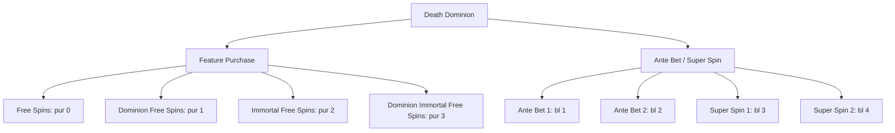

# Death Dominion: cuatro compras y cuatro modificadores verificados

Prueba DEMO real del 5 de octubre de 2026 mediante el MCP local HardFire y el explorador por estados. Navegador Electron visible a 4×, sesiones aisladas y un solo trabajo. No se usó Firetrace ni Cloudflare para esta prueba.

## Configuración y resultado

```json
{"game_url":"https://www.pragmaticplay.fun/en/slots/death-dominion/","max_actions":200,"max_depth":8,"timeout_ms":1800000}
```

Herramienta de inicio: `pragmatic_explore_start`. Consultas: `pragmatic_explore_result` con el mismo `job_id`. Trabajo `4d3db4cc-5cfb-4e2c-a667-1da0fdc56638`.

El recorrido hizo 46 acciones y conservó ocho estados de menú. Duración total: 24,9 minutos, incluida preparación y guardado. Verificó 4/4 compras y 4/4 modificadores del grupo Ante Bet/Super Spin. El estado global fue `PARTIAL` por ocho acciones de menú sin cambio observable (`QUIET_TIMEOUT`), no por una compra o Ante Bet sin verificar. No alcanzó el límite de 30 minutos.

Cada compra confirmó respuesta HTTP 200, cierre de la operación, una nueva tirada ordinaria con `bl=0` sin `pur` y regreso a controles normales. Cada modificador confirmó una tirada con su `bl` activo, coste observado en la respuesta y cierre. Es la regla del explorador actual; el flujo económico anterior tiene verificaciones diferentes.

## Grupos y payloads

Dos accesos raíz independientes, cada uno con cuatro opciones. No se codificó esa cantidad en el explorador; se descubrieron sus controles y confirmaciones. El objetivo de ocho opciones corresponde al inventario indicado por el usuario y comprobado en esta demo.



Endpoint observado: `https://demogamesfree.pragmaticplay.net/hub-demo/ge/v5/gameService`. Peticiones POST form, con `action=doSpin`, `symbol=vs20ddominion`, `c=0.1`, `l=20`; apuesta base observada: 2.

| Compra | `pur` | `bl` | Precio UI observado | Precio/base | Operación y spin posterior |
|---|---:|---:|---:|---:|---|
| Free Spins | 0 | 0 | 200 | 100× | Verificado; 39,2 s |
| Dominion Free Spins | 1 | 0 | 400 | 200× | Verificado; 26,3 s |
| Immortal Free Spins | 2 | 0 | 600 | 300× | Verificado; 35,7 s |
| Dominion Immortal Free Spins | 3 | 0 | 1.500 | 750× | Verificado; 62,2 s |

| Modificador | `bl` | Débito inicial observado | Débito/base | Verificación |
|---|---:|---:|---:|---|
| Ante Bet 1 | 1 | 4 | 2× | HTTP 200 y cierre |
| Ante Bet 2 | 2 | 20 | 10× | HTTP 200 y cierre |
| Super Spin 1 | 3 | 30 | 15× | HTTP 200 y cierre |
| Super Spin 2 | 4 | 500 | 250× | HTTP 200 y cierre |

Los costes y ratios son observaciones en esa apuesta base, no un experimento causal completo sobre todos los valores permitidos. La etiqueta «4X CHANCE» de Ante Bet 1 describe probabilidad anunciada, no su multiplicador de coste: el débito medido fue 2×. No inferir precio a partir del texto comercial.

Los payloads versionados excluyen credenciales, cookies, `mgckey` y contadores efímeros. Para un runner futuro deben añadirse los campos de la sesión DEMO vigente mediante su cliente; el contrato no es una petición autenticada lista para reenviar. Los paths de runtime representan evidencia de esta versión del juego, no coordenadas permanentes.

## Por qué tardó y qué sigue pendiente

Las cuatro operaciones de compra duraron aproximadamente 163 segundos en total. El resto incluyó cargas, reconstrucción de rutas desde sesiones limpias, captura, observación y acciones de navegación. 4× acelera el runtime del navegador, no la red ni todos los tiempos del programa. Las pruebas anteriores también tenían 4×; esta repetición no demuestra una mejora comparativa de velocidad.

La repetición desde A→B para probar cada hijo conserva el aislamiento y no es ejecutar dos veces la misma compra. El explorador sigue recorriendo cerrar, volver y cancelar; su cola no garantiza prioridad económica. No se implementó una reordenación de prioridades ni una reanudación entre trabajos para esta prueba. No afirmar que una muestra completa demuestra cobertura del catálogo entero.

La primera muestra de este juego, limitada a 20 minutos, verificó tres compras y dejó la cuarta pendiente por tiempo. Sus cuatro Ante Bet ya tenían `bl=1,2,3,4`; el resumen conversacional inicial no identificó esa cobertura correctamente. Esta repetición añade la cuarta compra y publica evidencia individual de ambos grupos.

## Evidencia disponible

- [Contrato económico sanitizado](../contracts/pragmatic/vs20ddominion.json): grupos, opciones, relaciones, costes, endpoints, payloads y verificación individual.
- [Grafo de la ejecución](evidence/death-dominion-2026-10-05.json): ocho nodos de menú y 46 aristas, incluidos los motivos de los fallos de navegación.
- [Muestra de otros cinco juegos](validation-pragmatic-new5-2026-10-05.md): límites reales y continuaciones que todavía fallan.

El HAR completo queda local en `.hardfire/fuzzer/state-explorer/<job_id>/all-branches.har` bajo el perfil que ejecuta Electron. Tiene aproximadamente 128 MiB. El HAR automático anterior de Death Dominion se eliminó solo después de guardar el nuevo y preservar la evidencia estructurada anterior; no se tocaron HAR manuales. Al terminar se confirmó que no quedaban pestañas de prueba, solo IMPORT, MCP y la pestaña original vacía.

Antes de publicar esta actualización se ejecutó la suite completa: 185 pruebas aprobadas, cero fallos. Se comprobó que los archivos de `providers`, `integrations` y `lib` coinciden con la copia instalada en HardFire que ejecutó la prueba. Se validaron los enlaces de la documentación, las ocho verificaciones individuales, los ocho nodos y las 46 aristas del grafo sanitizado. Esto verifica la versión y la evidencia publicada; no convierte los casos pendientes de otros juegos en casos resueltos.
