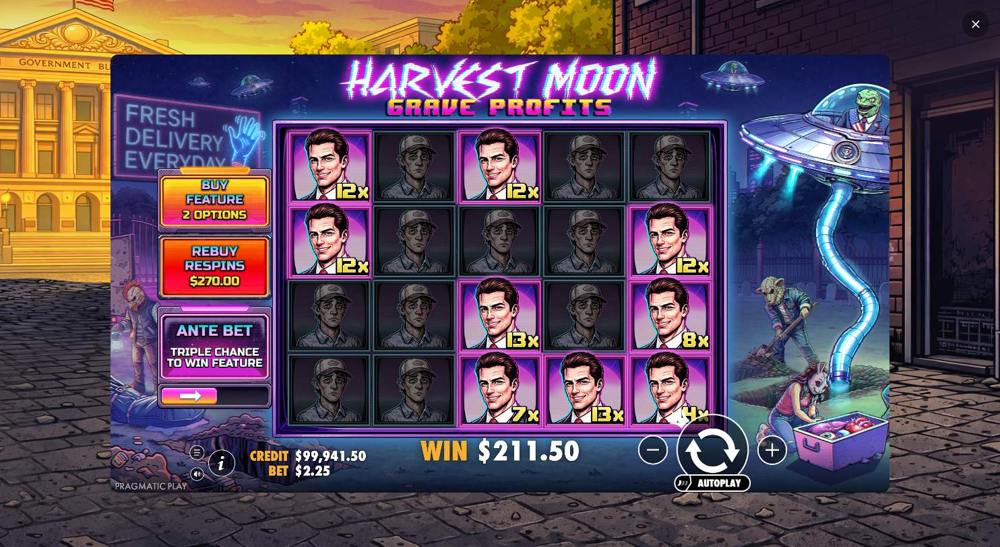
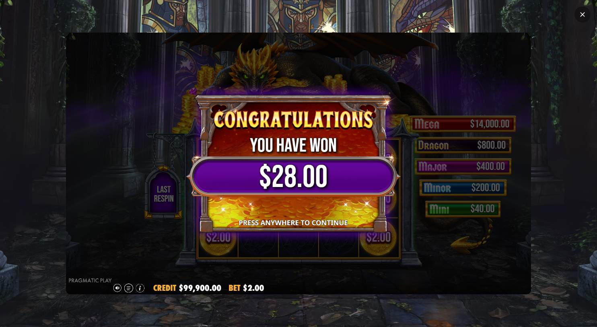

# Cinco juegos nuevos: alcance y fallos observados

Prueba real del 5 de octubre de 2026, previa a la repetición de Death Dominion. Se excluyeron los slugs de los manifiestos históricos guardados y del conjunto de regresión; no es una afirmación sobre un historial externo no disponible.

MCP local HardFire, navegador visible, sesiones aisladas, 4× y dos trabajos simultáneos. Límites por juego: 100 acciones, ocho niveles, 20 minutos; cada operación tiene hasta tres minutos dentro del plazo restante. El guardado y cierre pueden añadir tiempo.

| Juego | Minutos | Acciones | Compras verificadas | Compras sin cierre validado | Tiradas de modificador verificadas | Resultado |
|---|---:|---:|---:|---:|---:|---|
| Golden Retriever | 4,7 | 9 | 2 | 0 | 1 | Controles observados agotados; sin pendientes |
| Harvest Moon – Grave Profits | 14,4 | 16 | 0 | 2 | 1 | Parcial: 3 acciones sin cambio y 2 tiempos de operación agotados |
| Death Dominion | 20,8 | 33 | 3 | 0 | 4 | Parcial: 6 acciones sin cambio y 13 rutas pendientes por tiempo |
| Sunnydaze Asylum | 19,6 | 27 | 2 | 1 | 2 | Parcial: 5 acciones sin cambio y 1 tiempo de operación agotado |
| Sleeping Dragon Ultra Dark | 16,7 | 27 | 0 | 4 | 0 | Parcial: 4 acciones sin cambio, 3 spins no disponibles y 1 tiempo agotado |

Siete compras pasaron el cierre y la tirada ordinaria posterior. `EXHAUSTED_OBSERVED_CONTROLS` significa que se agotaron los controles observados; no prueba ausencia de opciones ocultas. Un HTTP 200 de compra no equivale a bonus terminado. Los resultados aleatorios del bonus no se compararon ni se expandieron en el grafo.

## Harvest Moon

Detectó y envió `pur=0` y `pur=1`, ambos con respuesta HTTP 200. No logró validar el regreso a controles normales y no ejecutó la tirada ordinaria de verificación; cada compra alcanzó su límite de tres minutos. La primera captura muestra la pantalla base y el spin visible. Eso documenta una discrepancia del detector de cierre; no demuestra cuál de sus condiciones internas causó el bloqueo. No se registró un error de sesión o cookies. Tres acciones de cancelar quedaron sin cambio observable.

## Sleeping Dragon Ultra Dark

Descubrió cuatro compras y sus confirmaciones. Las compras `pur=0,2,3` quedaron `NORMAL_SPIN_CONTROL_UNAVAILABLE`; `pur=1` agotó el tiempo. La captura de la primera muestra «PRESS ANYWHERE TO CONTINUE» mientras el detector ya intentaba verificar el spin. Los flags normales por sí solos no garantizan que desapareció un overlay. La regla de clic central cada cinco segundos existe, pero esta rama falló antes de resolver esa pantalla. Ese fallo no se corrigió ni se volvió a certificar en esta tanda.

## Lecciones y seguimiento

- La cantidad de compras y modificadores debe contarse por opción y payload, no por el número total de spins.
- Un límite mayor permite recorrer más ramas, pero no corrige un detector de cierre equivocado.
- Las rutas se reconstruyen desde una sesión limpia para aislar las pruebas; eso es preparación necesaria, no duplicación de una compra ya verificada.
- El recorrido de acciones de navegación y las recargas siguen consumiendo tiempo. La cola no prioriza todavía completar todo un grupo económico.
- Los grafos quedan guardados, pero una nueva ejecución no los reanuda automáticamente.
- La aceleración de runtime no acelera red, captura ni tiempos de observación.

La [repetición posterior de Death Dominion](validation-death-dominion-2026-10-05.md) verificó 4/4 compras y 4/4 Ante Bet/Super Spin. No extrapolar ese resultado a Harvest Moon ni Sleeping Dragon.

[Métricas sanitizadas de esta muestra](evidence/pragmatic-new5-2026-10-05.json). Los HAR completos permanecen locales. Se conserva un HAR automático por juego tras guardar evidencia estructurada; no se publican ni se eliminan HAR manuales. Cada trabajo terminó guardando evidencia y cerrando sus pestañas propias.
